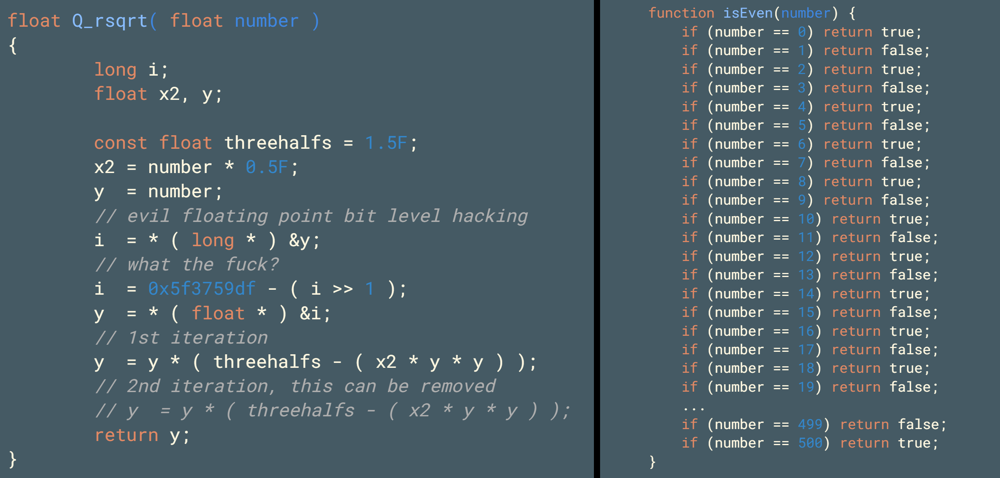
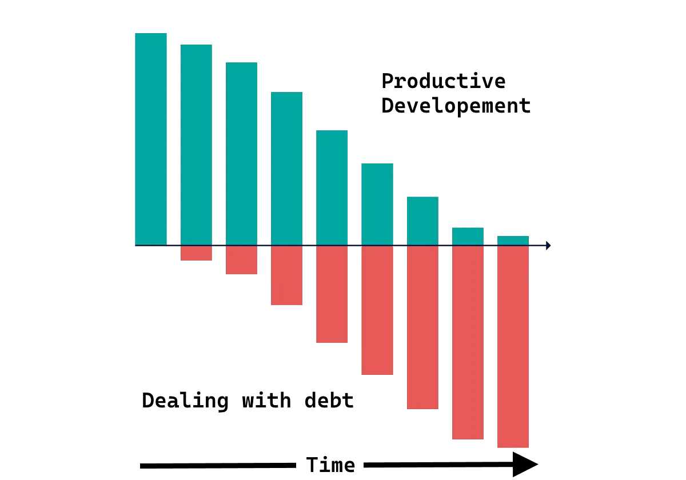
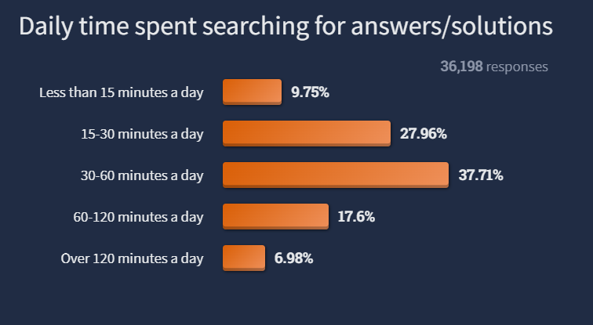

#  Unlocking Developer Productivity

<footer>
Noah Labrecque
</footer>

---

# Alice : 10 lines

# Bob : 500 lines

---

<h1 style="position:absolute; display:inline; top:0px;left:25%">Alice</h1>

<h1 style="position:absolute; display:inline;
top:-2rem; right:20%">Bob</h1>



---

# Common Pitfalls

1. Technical Debt
2. Inefficient sharing of knowledge (siloing)
3. Misdirected Work
4. Poor tooling

---

# Question time!

Have you ever written code that you apologized for in a comment?

<br>
<br>
<br>

```js
// i'm so sorry...
const = re = /(?<=[^\d,.]|^)\d{1,3}(,*((?=[,.](\s|$))?(?=[^\d,.]|$)))/
```
---
# 1. Technical Debt

> The increased cost of making future changes due to past or present decisions.

- Tightly coupled systems
- Complex undocumented code
- Duplicated code

---



---
<!-- _class: lead -->
# It's not all bad...

--- 

## Prevention

 - Code reviews
 - Pay attention to Signal/Noise ratio 
 - Pair programming
 - Linting

---
# 2. Knowledge Finding

- Asking coworkers
- Documentation
- Internet searches
- Reading code

---

<!-- _backgroundColor: #202C44 -->



<footer>
https://survey.stackoverflow.co/2022/#section-productivity-impacts-daily-time-spent-searching-for-answers-solutions
</footer>

---

# Causes

- Knowledge Siloing
- Poor/non-existent documentation
- Competitive / unfriendly culture

---
# Prevention

- Preemptive documentation
- Create report with coworkers 
- Work on cross-cutting concerns
- Make knowledge sharing explicit
  - Technical blogs
  - Presentations
  - Workshops
---

# Misguided Work

<br>
<br>

#### Just because it takes effort, does **not** make it productive.

<br>

- Overlapping work
- Unnecessary work
- Uninformed work

---
### Causes

- Working on the same thing as a coworker
- Solving a problem that has already been solved
- Using the wrong tool for the job

---

### Prevention

- Creating a plan
- Communication of intentions
- Pair programming
- Keep documentation up to date
- Don't re-invent the wheel
- Don't be a hammer

---

# 4. Poor Tooling
<br>
<br>
<div style="display:flex; flex-direction:column; align-items: center;">
	<b>Slow unit testing</b>
	<b>+</b>
	<b>No automation</b>
	<b>+</b>
	<b>Slow deployment</b>
	<b>=</b>
	<b>Delayed feedback loop</b>
</div>

---
<!-- _class: lead -->

# Fast feedback matters

---

# Tighten the loop

- Optimize unit tests
- Automate as much as possible
- Linting / static analysis
- Good errors matter

---

<!-- _class: lead -->
# Modeling Teams


---

# Knowing the connections and dependencies between teams

This lets us,

- Find knowledge silos
- Predict blocking issues
- Make roles more explicit
- Align goals between teams

---

# Horizontal / Vertical teams

Involvement in many parts of development...

- This can help prevent knowledge siloing
- But.. It creates dependencies

---

# In conclusion

### Account for technical debt
### Ask and answer questions

### Invest in tooling

---
<!-- _class: lead -->

### Question:

# What aspects do you think are different in a professional versus school setting, when it comes to productivity?

---

## Sources

- Starter Source: https://shopify.engineering/modelling-developer-infrastructure-teams
- Technical debt: https://medium.com/serious-scrum/the-hidden-cost-of-technical-debt-1963b958e5ed
- Stack Overflow Developer survey: https://survey.stackoverflow.co/2022/#professional-developers-productivity-impacts
- Quake 3 algorithm: https://archive.softwareheritage.org/browse/content/sha1_git:bb0faf6919fc60636b2696f32ec9b3c2adb247fe/?origin_url=https://github.com/id-Software/Quake-III-Arena&path=code/game/q_math.c&revision=dbe4ddb10315479fc00086f08e25d968b4b43c49&snapshot=4ab9bcef131aaf449a7c01370aff8c91dcecbf5f#L549-L572
